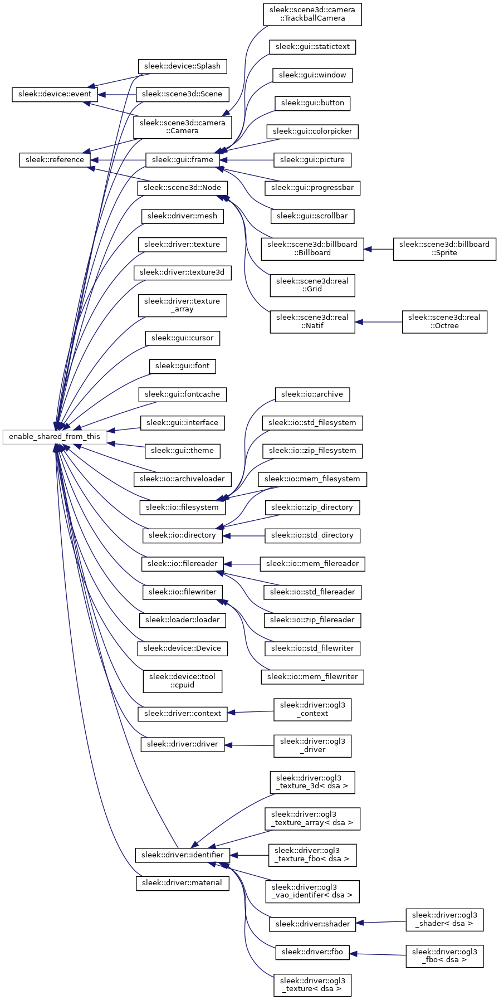

# sleek-engine

Homemade 3d engine during 2011-2017 (started as a simple example for someone)
This engine support various window device such as :

+ SDL / SDL2
+ X11 / XF86
+ WIN32
+ GTK (TODO)

This engine support various file system :

+ memory
+ std (starndar)
+ zip

This engine support different file loader (texture and mesh) :

+ 3DS / OBJ / TXT
+ BLP / BMP / JPG / PCX / PGM / PNG / TGA / TIFF
+ Other support can be write or given by external loader

This engine support various standar 3d features :

+ Texture (2d, 3d, array)
+ Shader (fragment, vertex, geometri, tesselation and compute)
+ GPU Buffers (FBO, VAO)

This engine include various utilities such as :

+ a primitive scene manager with some simple nodes (camera fps/trackball, billboard, mesh...)
+ a user interface (window, button, color picker, ...)
+ actualy single plugin (vidéo reader/render with ffmpeg)

In addition 3 examples is available:

+ Mateball rendering
+ CPU/GPU skinning with LinearBlending or DualQuaternion
+ PostProcessing (SSAO, blur, FXAA, redux, tone mapping)

Actully only opengl3 context is supported but the architect allow to define new context (ogl4 experimental support is planned)
But directx or cpu driver is not planned to be implemented but possible.

